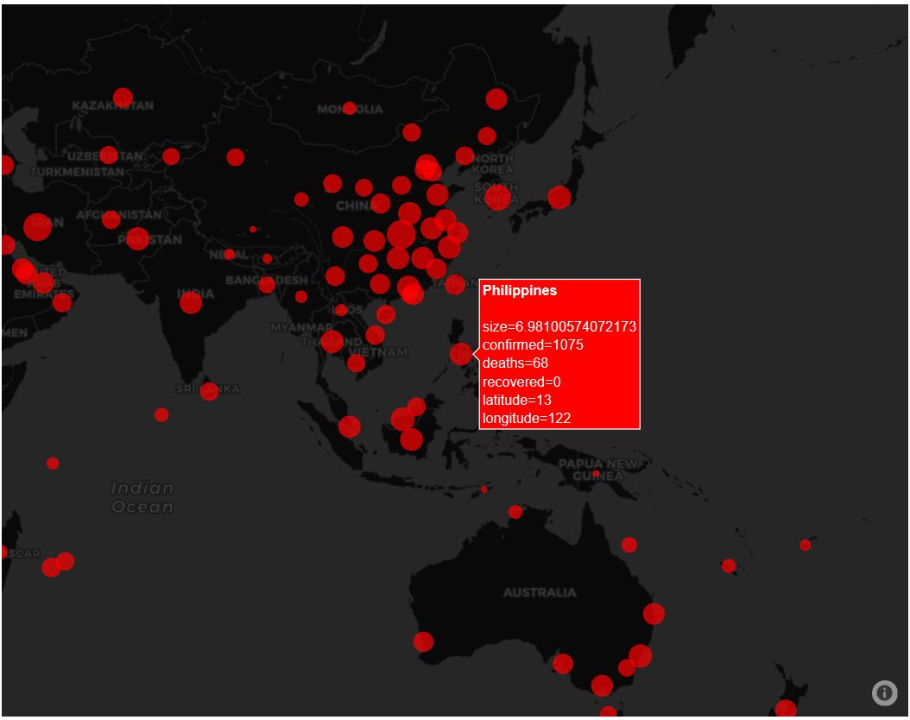
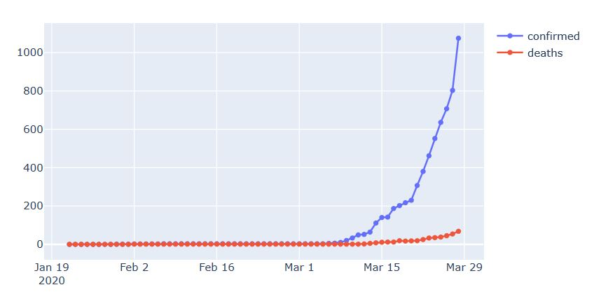

## Description
This is a simple covid-19 tracker, modified for Philippines. This is built using Django. The data is pulled via API from
https://github.com/CSSEGISandData/COVID-19 - Worldwide Data repository operated by the Johns Hopkins University Center for Systems Science and Engineering (JHU CSSE).

## Requirements
- Python 3.7+
- Django
- Pandas
- Plotly
- Covid19Py

## Intallation
- It is recommended to create an environment using conda or virtualenv
- Download or clone this repo.
- cd to root directory
- In your terminal run:  
`$ pip install -r requirements.txt`
- Once completed, cd to 'mysite'  
`python manage.py runserver`  
to run to local ip address.
## Preview
- 
- 

## Credits
- Johns Hopkins University Center for Systems Science and Engineering (JHU CSSE)
- https://github.com/Kamaropoulos/COVID19Py API
